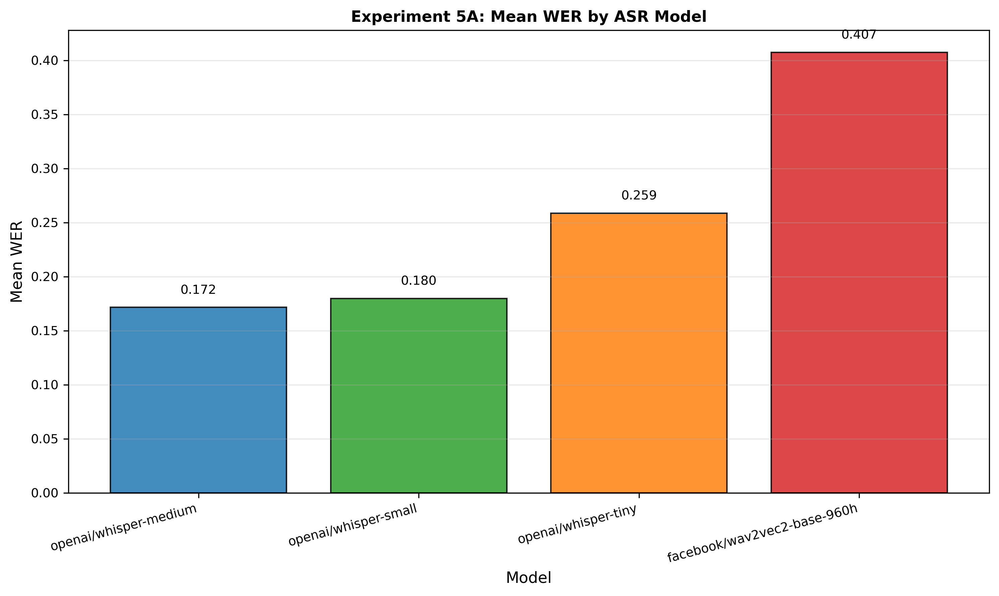

# Multi-Modal Generative AI: IP-Adapter Image Conditioning and Audio Generation/Understanding

### A Systematic Parametric Study of IP-Adapter Image Variation, Block-Level Style Transfer, Automatic Speech Recognition, and Text-to-Speech Synthesis Using Stable Diffusion XL, Whisper, and Bark

---

<svg xmlns="http://www.w3.org/2000/svg" width="109" height="20" role="img" aria-label="Python: 3.10+"><title>Python: 3.10+</title><linearGradient id="s" x2="0" y2="100%"><stop offset="0" stop-color="#bbb" stop-opacity=".1"/><stop offset="1" stop-opacity=".1"/></linearGradient><clipPath id="r"><rect width="109" height="20" rx="3" fill="#fff"/></clipPath><g clip-path="url(#r)"><rect width="66" height="20" fill="#555"/><rect x="66" width="43" height="20" fill="#007ec6"/><rect width="109" height="20" fill="url(#s)"/></g><g fill="#fff" text-anchor="middle" font-family="Verdana,Geneva,DejaVu Sans,sans-serif" text-rendering="geometricPrecision" font-size="110"><image x="5" y="3" width="14" height="14" href="data:image/svg+xml;base64,PHN2ZyBmaWxsPSJ3aGl0ZSIgcm9sZT0iaW1nIiB2aWV3Qm94PSIwIDAgMjQgMjQiIHhtbG5zPSJodHRwOi8vd3d3LnczLm9yZy8yMDAwL3N2ZyI+PHRpdGxlPlB5dGhvbjwvdGl0bGU+PHBhdGggZD0iTTE0LjI1LjE4bC45LjIuNzMuMjYuNTkuMy40NS4zMi4zNC4zNC4yNS4zNC4xNi4zMy4xLjMuMDQuMjYuMDIuMi0uMDEuMTNWOC41bC0uMDUuNjMtLjEzLjU1LS4yMS40Ni0uMjYuMzgtLjMuMzEtLjMzLjI1LS4zNS4xOS0uMzUuMTQtLjMzLjEtLjMuMDctLjI2LjA0LS4yMS4wMkg4Ljc3bC0uNjkuMDUtLjU5LjE0LS41LjIyLS40MS4yNy0uMzMuMzItLjI3LjM1LS4yLjM2LS4xNS4zNy0uMS4zNS0uMDcuMzItLjA0LjI3LS4wMi4yMXYzLjA2SDMuMTdsLS4yMS0uMDMtLjI4LS4wNy0uMzItLjEyLS4zNS0uMTgtLjM2LS4yNi0uMzYtLjM2LS4zNS0uNDYtLjMyLS41OS0uMjgtLjczLS4yMS0uODgtLjE0LTEuMDUtLjA1LTEuMjMuMDYtMS4yMi4xNi0xLjA0LjI0LS44Ny4zMi0uNzEuMzYtLjU3LjQtLjQ0LjQyLS4zMy40Mi0uMjQuNC0uMTYuMzYtLjEuMzItLjA1LjI0LS4wMWguMTZsLjA2LjAxaDguMTZ2LS44M0g2LjE4bC0uMDEtMi43NS0uMDItLjM3LjA1LS4zNC4xMS0uMzEuMTctLjI4LjI1LS4yNi4zMS0uMjMuMzgtLjIuNDQtLjE4LjUxLS4xNS41OC0uMTIuNjQtLjEuNzEtLjA2Ljc3LS4wNC44NC0uMDIgMS4yNy4wNXptLTYuMyAxLjk4bC0uMjMuMzMtLjA4LjQxLjA4LjQxLjIzLjM0LjMzLjIyLjQxLjA5LjQxLS4wOS4zMy0uMjIuMjMtLjM0LjA4LS40MS0uMDgtLjQxLS4yMy0uMzMtLjMzLS4yMi0uNDEtLjA5LS40MS4wOXptMTMuMDkgMy45NWwuMjguMDYuMzIuMTIuMzUuMTguMzYuMjcuMzYuMzUuMzUuNDcuMzIuNTkuMjguNzMuMjEuODguMTQgMS4wNC4wNSAxLjIzLS4wNiAxLjIzLS4xNiAxLjA0LS4yNC44Ni0uMzIuNzEtLjM2LjU3LS40LjQ1LS40Mi4zMy0uNDIuMjQtLjQuMTYtLjM2LjA5LS4zMi4wNS0uMjQuMDItLjE2LS4wMWgtOC4yMnYuODJoNS44NGwuMDEgMi43Ni4wMi4zNi0uMDUuMzQtLjExLjMxLS4xNy4yOS0uMjUuMjUtLjMxLjI0LS4zOC4yLS40NC4xNy0uNTEuMTUtLjU4LjEzLS42NC4wOS0uNzEuMDctLjc3LjA0LS44NC4wMS0xLjI3LS4wNC0xLjA3LS4xNC0uOS0uMi0uNzMtLjI1LS41OS0uMy0uNDUtLjMzLS4zNC0uMzQtLjI1LS4zNC0uMTYtLjMzLS4xLS4zLS4wNC0uMjUtLjAyLS4yLjAxLS4xM3YtNS4zNGwuMDUtLjY0LjEzLS41NC4yMS0uNDYuMjYtLjM4LjMtLjMyLjMzLS4yNC4zNS0uMi4zNS0uMTQuMzMtLjEuMy0uMDYuMjYtLjA0LjIxLS4wMi4xMy0uMDFoNS44NGwuNjktLjA1LjU5LS4xNC41LS4yMS40MS0uMjguMzMtLjMyLjI3LS4zNS4yLS4zNi4xNS0uMzYuMS0uMzUuMDctLjMyLjA0LS4yOC4wMi0uMjFWNi4wN2gyLjA5bC4xNC4wMXptLTYuNDcgMTQuMjVsLS4yMy4zMy0uMDguNDEuMDguNDEuMjMuMzMuMzMuMjMuNDEuMDguNDEtLjA4LjMzLS4yMy4yMy0uMzMuMDgtLjQxLS4wOC0uNDEtLjIzLS4zMy0uMzMtLjIzLS40MS0uMDgtLjQxLjA4eiIvPjwvc3ZnPg=="/><text aria-hidden="true" x="425" y="150" fill="#010101" fill-opacity=".3" transform="scale(.1)" textLength="390">Python</text><text x="425" y="140" transform="scale(.1)" fill="#fff" textLength="390">Python</text><text aria-hidden="true" x="865" y="150" fill="#010101" fill-opacity=".3" transform="scale(.1)" textLength="330">3.10+</text><text x="865" y="140" transform="scale(.1)" fill="#fff" textLength="330">3.10+</text></g></svg>


<svg xmlns="http://www.w3.org/2000/svg" width="120" height="20" role="img" aria-label="PyTorch: 2.0+"><title>PyTorch: 2.0+</title><linearGradient id="s" x2="0" y2="100%"><stop offset="0" stop-color="#bbb" stop-opacity=".1"/><stop offset="1" stop-opacity=".1"/></linearGradient><clipPath id="r"><rect width="120" height="20" rx="3" fill="#fff"/></clipPath><g clip-path="url(#r)"><rect width="70" height="20" fill="#555"/><rect x="70" width="50" height="20" fill="#ee4c2c"/><rect width="120" height="20" fill="url(#s)"/></g><g fill="#fff" text-anchor="middle" font-family="Verdana,Geneva,DejaVu Sans,sans-serif" text-rendering="geometricPrecision" font-size="110"><image x="5" y="3" width="14" height="14" href="data:image/svg+xml;base64,PHN2ZyBmaWxsPSJ3aGl0ZSIgcm9sZT0iaW1nIiB2aWV3Qm94PSIwIDAgMjQgMjQiIHhtbG5zPSJodHRwOi8vd3d3LnczLm9yZy8yMDAwL3N2ZyI+PHRpdGxlPlB5dGhvbjwvdGl0bGU+PHBhdGggZD0iTTE0LjI1LjE4bC45LjIuNzMuMjYuNTkuMy40NS4zMi4zNC4zNC4yNS4zNC4xNi4zMy4xLjMuMDQuMjYuMDIuMi0uMDEuMTNWOC41bC0uMDUuNjMtLjEzLjU1LS4yMS40Ni0uMjYuMzgtLjMuMzEtLjMzLjI1LS4zNS4xOS0uMzUuMTQtLjMzLjEtLjMuMDctLjI2LjA0LS4yMS4wMkg4Ljc3bC0uNjkuMDUtLjU5LjE0LS41LjIyLS40MS4yNy0uMzMuMzItLjI3LjM1LS4yLS4zNi0uMTUtLjM2LS4xLS4zNS0uMDctLjMyLjA0LS4yOC4wMi0uMjFWNi4wN2gyLjA5bC4xNC4wMXptLTYuNDcgMTQuMjVsLS4yMy4zMy0uMDguNDEuMDguNDEuMjMuMzMuMzMuMjMuNDEuMDguNDEtLjA4LjMzLS4yMy4yMy0uMzMuMDgtLjQxLS4wOC0uNDEtLjIzLS4zMy0uMzMtLjIzLS40MS0uMDgtLjQxLjA4eiIvPjwvc3ZnPg=="/><text aria-hidden="true" x="425" y="150" fill="#010101" fill-opacity=".3" transform="scale(.1)" textLength="390">PyTorch</text><text x="425" y="140" transform="scale(.1)" fill="#fff" textLength="390">PyTorch</text><text aria-hidden="true" x="875" y="150" fill="#010101" fill-opacity=".3" transform="scale(.1)" textLength="330">2.0+</text><text x="875" y="140" transform="scale(.1)" fill="#fff" textLength="330">2.0+</text></g></svg>

<svg xmlns="http://www.w3.org/2000/svg" width="116" height="20" role="img" aria-label="🤗 Diffusers: 0.25+"><title>🤗 Diffusers: 0.25+</title><linearGradient id="s" x2="0" y2="100%"><stop offset="0" stop-color="#bbb" stop-opacity=".1"/><stop offset="1" stop-opacity=".1"/></linearGradient><clipPath id="r"><rect width="116" height="20" rx="3" fill="#fff"/></clipPath><g clip-path="url(#r)"><rect width="73" height="20" fill="#555"/><rect x="73" width="43" height="20" fill="#dfb317"/><rect width="116" height="20" fill="url(#s)"/></g><g fill="#fff" text-anchor="middle" font-family="Verdana,Geneva,DejaVu Sans,sans-serif" text-rendering="geometricPrecision" font-size="110"><text aria-hidden="true" x="375" y="150" fill="#010101" fill-opacity=".3" transform="scale(.1)" textLength="630">🤗 Diffusers</text><text x="375" y="140" transform="scale(.1)" fill="#fff" textLength="630">🤗 Diffusers</text><text aria-hidden="true" x="935" y="150" fill="#010101" fill-opacity=".3" transform="scale(.1)" textLength="330">0.25+</text><text x="935" y="140" transform="scale(.1)" fill="#fff" textLength="330">0.25+</text></g></svg>

<svg xmlns="http://www.w3.org/2000/svg" width="116" height="20" role="img" aria-label="🤗 Transformers: 4.36+"><title>🤗 Transformers: 4.36+</title><linearGradient id="s" x2="0" y2="100%"><stop offset="0" stop-color="#bbb" stop-opacity=".1"/><stop offset="1" stop-opacity=".1"/></linearGradient><clipPath id="r"><rect width="116" height="20" rx="3" fill="#fff"/></clipPath><g clip-path="url(#r)"><rect width="73" height="20" fill="#555"/><rect x="73" width="43" height="20" fill="#dfb317"/><rect width="116" height="20" fill="url(#s)"/></g><g fill="#fff" text-anchor="middle" font-family="Verdana,Geneva,DejaVu Sans,sans-serif" text-rendering="geometricPrecision" font-size="110"><text aria-hidden="true" x="375" y="150" fill="#010101" fill-opacity=".3" transform="scale(.1)" textLength="630">🤗 Transformers</text><text x="375" y="140" transform="scale(.1)" fill="#fff" textLength=" 730">🤗 Transformers</text><text aria-hidden="true" x="935" y="150" fill="#010101" fill-opacity=".3" transform="scale(.1)" textLength="330">4.36+</text><text x="935" y="140" transform="scale(.1)" fill="#fff" textLength="330">4.36+</text></g></svg>


---

**Author:** Ryan Kamp  
**Affiliation:** Department of Computer Science, University of Cincinnati  
**Location:** Cincinnati, OH, USA  
**Email:** kamprj@mail.uc.edu  
**GitHub:** https://github.com/ryanjosephkamp  
**Course:** CS6078 Generative AI  
**Assignment:** Assignment 13 — IP-Adapter Image Conditioning & Audio Generation/Understanding  
**Date:** April 2026

---

## Table of Contents

1. [Abstract](#abstract)
2. [Project Overview](#project-overview)
3. [Research Questions](#research-questions)
4. [The Five Scripts](#the-five-scripts)
5. [Experimental Design](#experimental-design)
6. [Key Findings](#key-findings)
7. [Selected Results](#selected-results)
8. [Getting Started](#getting-started)
9. [Usage](#usage)
10. [Project Structure](#project-structure)
11. [Reports and Documentation](#reports-and-documentation)
12. [References](#references)
13. [License](#license)

---

## Abstract

This project presents a systematic parametric study spanning two generative AI modalities — **vision** and **audio** — based on Chapters 8 and 9 of *Hands-on Generative AI with Transformers and Diffusion Models* (Alammar & Grootendorst, O'Reilly, 2024). Through seven experiments encompassing **149 generated images**, **29 synthesized audio files**, **164 ASR transcriptions**, and **339 total parameter configurations**, the study investigates:

- **IP-Adapter uniform-scale image variation** via SDXL Base with decoupled cross-attention (GA18B)
- **Block-level style transfer and content–style disentanglement** via per-layer IP-Adapter scale control (GA18C)
- **Text–image interaction** under simultaneous IP-Adapter and text prompt conditioning (GA18B + GA18C)
- **Automatic speech recognition** with Whisper model comparison and sampling rate robustness analysis (GA19B)
- **Text-to-speech synthesis** with Bark, evaluating generation consistency and round-trip fidelity (GA19C)

All experiments were executed on Google Colab with NVIDIA A100/H100 GPUs using FP16 precision, accumulating **828.2 seconds** of total GPU computation time. Key findings include: a recommended IP-Adapter scale range of $\lambda \in [0.4, 0.7]$ for balancing reference fidelity and creative variation; effective content–style disentanglement through selective upsampling-block conditioning; Whisper-medium achieving a word error rate (WER) of 0.172 on conversational banking-domain speech; and Bark TTS generating speech at approximately $2.3\times$ real-time with high seed-dependent variability.

---

## Project Overview

### Course Context

This project extends a homework assignment for **CS6078 Generative AI** (Spring 2026, University of Cincinnati). The assignment is drawn from Chapters 8 (Image Prompting with IP-Adapter) and 9 (Audio Generation and Understanding) of the course textbook.

### Original Assignment Description

> *"Run GA18B.py and GA18C.py for image prompting and also GA19B.py for automatic speech recognition and show your results. You may change the images and other parameters."*

### Research Extension

Rather than merely running the three required scripts at default settings, this project designs and executes a comprehensive experimental study that:

1. **Reproduces baseline results** from all five scripts (GA18B, GA18C, GA19A, GA19B, GA19C) with their default parameters.
2. **Systematically varies key parameters** — IP-Adapter scales, block-level configurations, reference images, text prompts, ASR models, sampling rates, TTS inputs, and random seeds — to map the controllable generation design space across both modalities.
3. **Addresses seven research questions** concerning parameter sensitivity, content–style disentanglement, text–image interaction, ASR robustness, TTS consistency, seed sensitivity, and cross-modal comparison.
4. **Produces publication-quality deliverables** — a comprehensive markdown report, an IEEE-formatted LaTeX report, and professional repository documentation.

### Technical Foundation

The project spans two modalities and two distinct generative paradigms:

**Vision (Chapter 8) — IP-Adapter Image Conditioning.** The IP-Adapter introduces a **decoupled cross-attention** mechanism into the Stable Diffusion XL U-Net, enabling image-conditioned generation without retraining the base model. A CLIP image encoder extracts a reference image embedding, which is injected through dedicated key/value projections operating in parallel with the existing text cross-attention layers:

$$\mathbf{Z} = \text{Attention}(\mathbf{Q}, \mathbf{K}_t, \mathbf{V}_t) + \lambda \cdot \text{Attention}(\mathbf{Q}, \mathbf{K}_i, \mathbf{V}_i)$$

where $\lambda$ is the IP-Adapter scale controlling image conditioning strength, $\mathbf{K}_t, \mathbf{V}_t$ are text-conditioned keys/values, and $\mathbf{K}_i, \mathbf{V}_i$ are image-conditioned keys/values. GA18B applies a uniform $\lambda$ across all layers; GA18C uses a **per-block scale dictionary** to selectively condition specific U-Net upsampling layers, enabling content–style disentanglement.

**Audio (Chapter 9) — ASR and TTS.** GA19B demonstrates automatic speech recognition using the Hugging Face `transformers` pipeline API with models such as wav2vec 2.0 and OpenAI Whisper, applied to the MINDS-14 banking-domain speech dataset. GA19C demonstrates text-to-speech synthesis using the Bark model, a multi-stage autoregressive architecture that converts text to semantic tokens, coarse acoustic tokens, fine acoustic tokens, and finally raw audio waveforms via neural codec decoding.

---

<div style="page-break-after: always;"></div>

## Research Questions

This study addresses seven research questions spanning both vision and audio modalities:

| RQ | Question | Modality | Experiment |
|----|----------|----------|------------|
| **RQ1** | How does the uniform IP-Adapter scale $\lambda$ govern the trade-off between reference image fidelity and output variation? | Vision | Exp 2 |
| **RQ2** | How do different block-level IP-Adapter scale configurations affect the type and degree of style transfer in content–style disentanglement? | Vision | Exp 3 |
| **RQ3** | How do IP-Adapter image conditioning and text prompt conditioning interact when both are active simultaneously? | Vision | Exp 4 |
| **RQ4** | How do different ASR models compare on conversational banking-domain speech, and how robust is ASR to sampling rate mismatch? | Audio | Exp 5 |
| **RQ5** | How consistent is Bark's TTS output across repeated generations, and how do text input properties affect synthesized speech quality? | Audio | Exp 6 |
| **RQ6** | How sensitive are IP-Adapter image variations and Bark TTS outputs to the random seed? | Cross-modal | Exp 7 |
| **RQ7** | How do generative control mechanisms differ between vision (adapter-based diffusion) and audio (autoregressive TTS, pipeline-based ASR)? | Cross-modal | Cross-analysis |

<div style="page-break-after: always;"></div>

### Expanded Research Question Descriptions

**RQ1 — IP-Adapter Uniform Scale Sensitivity.** The IP-Adapter scale $\lambda$ controls the relative influence of the image conditioning signal via the decoupled cross-attention mechanism: $\mathbf{Z} = \mathbf{Z}_{\text{text}} + \lambda \cdot \mathbf{Z}_{\text{image}}$. This RQ systematically characterizes the full functional relationship between $\lambda$ and perceptual similarity to the reference image. *Hypothesis:* The fidelity–variation relationship is nonlinear, with the most perceptually interesting output in $\lambda \in [0.4, 0.8]$.

**RQ2 — Block-Level Style Transfer.** GA18C demonstrates content–style disentanglement by applying IP-Adapter conditioning to a single cross-attention layer within `block_0` of the U-Net's upsampling path. The design space of block-level configurations is vast. *Hypothesis:* Different upsampling blocks transfer different stylistic attributes — deeper blocks transfer global style qualities; shallower blocks transfer localized textural details.

**RQ3 — Text–Image Interaction.** GA18B uses an empty text prompt (pure image conditioning); GA18C uses a non-empty prompt with block-level conditioning. This RQ investigates the interaction when uniform IP-Adapter conditioning is combined with an active text prompt. *Hypothesis:* At low $\lambda$ (< 0.3), text dominates; at high $\lambda$ (> 0.7), the image dominates; the intermediate range produces a blend with gradual transition.

**RQ4 — ASR Model Comparison and Robustness.** This RQ has two parts: (a) comparing pre-trained ASR models (wav2vec 2.0, Whisper-tiny, Whisper-small, Whisper-medium) on MINDS-14 banking-domain speech; (b) quantifying the impact of sampling rate mismatch on transcription quality. *Hypothesis:* Whisper models outperform wav2vec 2.0; performance improves with model size; incorrect sampling rate produces significant WER increases.

**RQ5 — TTS Consistency and Variation.** Bark is a stochastic generative model whose autoregressive sampling introduces variation in prosody, intonation, and timing. *Hypothesis:* Repeated generations produce consistent semantic content but varying prosodic realization; shorter texts yield more consistent outputs; complex or domain-specific texts may introduce disfluencies.

**RQ6 — Seed Sensitivity.** For IP-Adapter, the random seed controls the initial noise tensor; for Bark, it controls autoregressive sampling across three transformer stages. *Hypothesis:* IP-Adapter exhibits decreasing seed sensitivity as $\lambda$ increases; Bark exhibits moderate sensitivity with consistent lexical content but varying prosody.

<div style="page-break-after: always;"></div>

**RQ7 — Cross-Modal Control Comparison.** A structural comparison of continuous latent diffusion with adapter-based conditioning (GA18B/GA18C), discrete token-based autoregressive generation (GA19C), and pipeline-based discriminative inference (GA19B). *Hypothesis:* Diffusion-based generation offers more fine-grained continuous control; TTS provides more precise content specification via text; ASR occupies a distinct position with objective WER/CER metrics.

---

## The Five Scripts

The project builds on five Python scripts spanning two chapters and two modalities:

| Script | Chapter | Modality | Paradigm | Model / Pipeline | Key Innovation |
|--------|---------|----------|----------|-----------------|----------------|
| **GA18B.py** | 8 | Vision | Image Variation | SDXL Base 1.0 + IP-Adapter (`ip-adapter_sdxl.bin`) | Decoupled cross-attention with uniform $\lambda$ scale |
| **GA18C.py** | 8 | Vision | Style Transfer | SDXL Base 1.0 + IP-Adapter (`ip-adapter_sdxl.bin`) | Block-level per-layer scale for content–style disentanglement |
| **GA19A.py** | 9 | Audio | Data Exploration | Hugging Face `datasets` + Gradio | MINDS-14 dataset inspection and interactive UI |
| **GA19B.py** | 9 | Audio | ASR (Speech → Text) | `transformers` pipeline (wav2vec 2.0 / Whisper) | Pre-trained ASR with audio resampling to 16 kHz |
| **GA19C.py** | 9 | Audio | TTS (Text → Speech) | Bark (`suno/bark-small`) | Multi-stage autoregressive audio generation via EnCodec |

<div style="page-break-after: always;"></div>

### Vision Progression: GA18B → GA18C

The vision scripts demonstrate **increasing granularity of control** over IP-Adapter image conditioning:

- **GA18B (Uniform Scale):** A single scalar $\lambda \in [0, 1]$ is applied equally across all U-Net cross-attention layers. At $\lambda = 0$, image conditioning is disabled; at $\lambda = 1$, it operates at full strength. With an empty text prompt, generation is driven entirely by the CLIP image embedding of the reference image.
- **GA18C (Block-Level Scale):** A per-block, per-layer scale dictionary (`{"up": {"block_0": [0.0, 1.0, 0.0]}}`) selectively applies image conditioning to individual cross-attention layers within specific upsampling blocks. This enables **content–style disentanglement**: the text prompt controls semantic content (e.g., "a cat inside of a box") while the reference image's style (color palette, texture, artistic character) is injected through targeted upsampling layers. The technique exploits the hierarchical feature encoding property of U-Net architectures — deeper layers encode global structure; shallower upsampling layers encode fine-grained stylistic details.

### Audio Progression: GA19A → GA19B → GA19C

The audio scripts form a complete **bidirectional audio processing pipeline**:

- **GA19A (Data Exploration):** Loads the MINDS-14 banking-domain speech dataset (`PolyAI/minds14`, en-AU subset) and provides a Gradio interface for interactive exploration of audio samples and intent labels.
- **GA19B (Speech → Text):** Runs automatic speech recognition on MINDS-14 audio clips using the Hugging Face `transformers` pipeline API. Audio is resampled to 16 kHz — the standard rate expected by ASR models — ensuring correct temporal interpretation of the signal.
- **GA19C (Text → Speech):** Synthesizes speech from text using Bark's multi-stage autoregressive architecture: text → semantic tokens → coarse acoustic tokens → fine acoustic tokens → raw audio waveform (via EnCodec neural codec decoding).

---

<div style="page-break-after: always;"></div>

## Experimental Design

### Overview

The study comprises **seven experiments** executed across **three GPU-optimized execution groups** on Google Colab (NVIDIA A100/H100, FP16 precision). Each group loads its primary model(s) once and runs all associated experiments before unloading, minimizing redundant model loading overhead.

| Group | Model(s) | Experiments | Primary Output |
|-------|----------|-------------|----------------|
| **A — Vision** | SDXL Base 1.0 + IP-Adapter | Exp 1 (baselines), 2, 3, 4, 7 (vision seeds) | 149 images |
| **B — ASR** | wav2vec 2.0, Whisper-tiny/small/medium | Exp 1 (baseline), 5 | 164 transcriptions |
| **C — TTS** | Bark (`suno/bark-small`) | Exp 1 (baseline), 6, 7 (TTS seeds) | 29 audio files |

<div style="page-break-after: always;"></div>

### Experiment Summary

| Exp | Name | Script(s) | RQ | Parameter Space | Outputs |
|-----|------|-----------|-----|----------------|---------|
| **1** | Baseline Reproduction | GA18B, GA18C, GA19A, GA19B, GA19C | — | All defaults, seed=42 | 2 images, 1 transcription, 1 audio |
| **2** | Uniform Scale Sensitivity | GA18B | RQ1 | $\lambda \in \{0.0, 0.1, \ldots, 1.0\}$; 3 seeds; alt. reference image; inference steps ∈ {10, 25, 50} | 51 images |
| **3** | Block-Level Configurations | GA18C | RQ2 | 6 layer configs, 3 upsampling blocks, 5 scale magnitudes, 4 text prompts, 2 reference images | 46 images |
| **4** | Text–Image Interaction | GA18B + GA18C | RQ3 | 6 uniform scales with active text, 3 prompt specificity levels, 3 semantic compatibility levels, block vs. uniform | 34 images |
| **5** | ASR Model Comparison | GA19B | RQ4 | 4 ASR models × 20 samples; 4 sampling rates × 2 models × 10 samples | 164 transcriptions |
| **6** | TTS Consistency | GA19C | RQ5 | 5 seeds (consistency), 3 text lengths, 3 domains, round-trip TTS→ASR | 29 audio files + 3 transcriptions |
| **7** | Seed Sensitivity | GA18B, GA18C, GA19C | RQ6 | 3 paradigms × 8 seeds ({42, 123, 456, 789, 1024, 2048, 3000, 4096}) | 16 images + 8 audio files |

<div style="page-break-after: always;"></div>

### Sub-Experiment Breakdown

**Experiment 2 — Sub-experiments:**
- **2A:** Scale sweep $\lambda \in \{0.0, 0.1, \ldots, 1.0\}$ × 3 seeds → 33 images
- **2B:** 6 scale values × 2 seeds with alternative reference image (`SampleURL.Mamoeiro`) → 12 images
- **2C:** Inference steps ∈ {10, 25, 50} at $\lambda=0.8$ × 2 seeds → 6 images

**Experiment 3 — Sub-experiments:**
- **3A:** 6 layer configurations within `block_0` × 3 seeds → 18 images
- **3B:** 3 upsampling blocks (`block_0`, `block_1`, `block_2`) × 2 seeds → 6 images
- **3C:** Block-level scale $s \in \{0.25, 0.5, 0.75, 1.0, 1.5\}$ × 2 seeds → 10 images
- **3D:** 4 text prompts × 2 seeds → 8 images
- **3E:** 2 reference images × 2 seeds → 4 images

**Experiment 4 — Sub-experiments:**
- **4A:** 6 uniform scales with active text prompt × 2 seeds → 12 images
- **4B:** 3 prompt specificity levels at $\lambda=0.5$ × 2 seeds → 6 images
- **4C:** 3 semantic compatibility levels at $\lambda=0.5$ × 2 seeds → 6 images
- **4D:** 2 prompts with block-level config × 2 seeds → 4 images
- **4E:** Uniform vs. block-level direct comparison × 3 seeds → 6 images

**Experiment 5 — Sub-experiments:**
- **5A:** 4 ASR models × 20 samples → 80 transcriptions
- **5B:** 4 sampling rates × 2 models × 10 samples → 80 transcriptions

**Experiment 6 — Sub-experiments:**
- **6A:** 5 seeds, same text → 5 audio files (consistency baseline)
- **6B:** 3 text lengths × 2 seeds → 6 audio files
- **6C:** 3 domains (conversational, technical, proper nouns) × 2 seeds → 6 audio files
- **6D:** Round-trip TTS→ASR on 3 texts → 3 audio files + 3 transcriptions


### Computational Budget

| Metric | Value |
|--------|-------|
| Total GPU time | **828.2 seconds** |
| Mean time per image (GA18B) | 1.58 s |
| Mean time per image (GA18C) | 1.44 s |
| Mean time per ASR transcription | 0.28 s |
| Mean time per TTS audio (Bark) | 19.2 s |
| Platform | Google Colab (NVIDIA A100 / H100), FP16 precision |

---

## Key Findings

### Vision — IP-Adapter Image Conditioning

1. **Uniform scale operates as a smooth, nonlinear, monotonic dial** (RQ1). The IP-Adapter scale $\lambda$ produces no abrupt perceptual thresholds; the steepest change in reference fidelity occurs between $\lambda = 0.2$ and $\lambda = 0.5$. The recommended operating range for balancing reference fidelity and creative variation is $\lambda \in [0.4, 0.7]$.

2. **Block-level conditioning enables effective content–style disentanglement** (RQ2). Restricting IP-Adapter conditioning to the deepest upsampling block (`block_0`) transfers global stylistic attributes (color temperature, tonal character) while preserving text-prompt-specified content. Shallower blocks (`block_2`) produce minimal visible style transfer. Multi-layer activation (`[1,1,1]`) produces the strongest style transfer via additive conditioning. The optimal block-level scale range is $s \in [0.5, 1.0]$.

3. **Text and image conditioning blend predictably under uniform scaling** (RQ3). More specific text prompts retain greater influence at moderate $\lambda$; semantically compatible text–image pairs produce more coherent outputs. Uniform scaling blends content and style from the reference image simultaneously, while block-level scaling separates them.

4. **Generation time is consistent across scales.** Mean generation time per image is 1.58 s (GA18B uniform) and 1.44 s (GA18C block-level) on A100/H100 GPUs with FP16 precision.

### Audio — ASR and TTS

5. **Whisper-medium achieves the lowest WER on banking-domain speech** (RQ4). On 20 MINDS-14 (en-AU) samples at 16 kHz: Whisper-medium WER = **0.172**, Whisper-small WER = **0.180**, Whisper-tiny WER = **0.259**, wav2vec 2.0 WER = **0.407**. The marginal gain from Whisper-small to Whisper-medium is modest while compute more than doubles (0.42 s → 0.74 s per sample).

6. **Sampling rate mismatch severely degrades ASR** (RQ4). Providing 8 kHz audio without resampling to the expected 16 kHz increases WER by **+83%** for wav2vec 2.0 (0.407 → 0.747) and **+129%** for Whisper-small (0.180 → 0.412). CER follows a comparable trend (wav2vec 2.0: 0.211 → 0.533; Whisper-small: 0.103 → 0.344).

7. **Bark TTS generates speech at approximately $2.3\times$ real-time** (RQ5). Generation time scales linearly with output duration across text lengths (short: 7.5 s for 3.2 s audio; long: 31.9 s for 13.8 s audio). Mean generation time across all experiments is 19.2 s per audio file.

8. **Bark exhibits high output variability across seeds** (RQ5). For the same input text, audio duration varies by 74% (7.4–12.9 s), and RMS amplitude spans a 6-fold range (0.023–0.143). Round-trip TTS→ASR WER ranges from 0.000 to 0.250 depending on text content.

### Cross-Modal — Seed Sensitivity

9. **Seed sensitivity differs dramatically across paradigms** (RQ6). Generation time coefficient of variation (CoV) across 8 seeds: GA18C = **0.3%** (near-deterministic), GA18B = **2.8%** (low variability), Bark = **17.3%** (high variability, generation times spanning 17.4–30.2 s). The ranking from lowest to highest seed sensitivity is GA18C < GA18B < GA19C.

10. **Control granularity inversely correlates with stochasticity** (RQ7). Image generation paradigms offer 5–6 controllable parameters with low-to-moderate stochasticity; ASR is fully deterministic with 3 parameters; Bark TTS has only 2 controllable parameters but exhibits the highest output variability. Computational cost spans two orders of magnitude: ASR at 0.28 s/output vs. TTS at 19.2 s/output.

---

<div style="page-break-after: always;"></div>

## Selected Results

### Experiment 1

#### Baseline Reproduction

All four generative scripts (GA18B, GA18C, GA19B, GA19C) were executed with their default parameters, producing a four-panel gallery that establishes the reference point for all subsequent experiments. GA18B generates a flat-lay coffee-cup photograph, GA18C produces an illustrated cat-in-box with painterly style, GA19B exposes substantial transcription errors from the baseline wav2vec 2.0 model on banking-domain speech, and GA19C yields a ~9-second Bark TTS waveform with variable amplitude envelope. These baselines confirm pipeline functionality and provide the visual and quantitative anchors against which parameter variations are measured ([Figure 1](#fig-1))

---

### Experiment 2

#### IP-Adapter Uniform Scale Sweep

An 11-point sweep from $\lambda = 0.0$ to $\lambda = 1.0$ across three seeds reveals the smooth, nonlinear, monotonic relationship between IP-Adapter scale and reference image fidelity. At $\lambda = 0.0$, outputs are diverse and unrelated to the reference; the steepest perceptual transition occurs between $\lambda = 0.2$ and $\lambda = 0.5$; and strong compositional and color fidelity to the coffee-cup flat-lay reference emerges by $\lambda \geq 0.5$. The recommended operating range of $\lambda \in [0.4, 0.7]$ offers the best balance between reference fidelity and creative variation ([Figure 2](#fig-2))

#### Alternative Reference Comparison

Replacing the default coffee-cup reference with a vibrant Brazilian-style tropical painting demonstrates that the uniform-scale behavior generalizes across visually distinct reference images. At low scales, outputs remain abstract and reference-independent; by $\lambda \geq 0.4$, the vivid color palette, tropical composition, and painterly style of the alternative reference increasingly dominate the generated images. This confirms that IP-Adapter scale functions as a content-agnostic conditioning dial whose perceptual effect is consistent regardless of reference image characteristics ([Figure 3](#fig-3))


#### Inference Steps Comparison

A comparison of 10, 25, and 50 inference steps at a fixed IP-Adapter scale shows that all step counts produce recognizable outputs consistent with the reference image, with only subtle improvements in fine detail and textural clarity at higher step counts. This suggests that the IP-Adapter conditioning signal is established early in the denoising process and that 25 steps provides a practical efficiency–quality trade-off ([Figure 4](#fig-4))

#### Generation Time Analysis

Mean GA18B generation time exhibits a non-monotonic relationship with IP-Adapter scale: time rises from ~1.42 s at $\lambda = 0.0$ to a peak of ~1.69 s at $\lambda = 0.6$, then decreases to ~1.49 s at $\lambda = 1.0$. This suggests that mid-range scales incur slightly higher computational overhead from the interplay of text and image cross-attention signals, while extreme values (where one modality dominates) are marginally faster. Overall, mean generation time remains within 1.58 s across the full scale range on A100/H100 GPUs with FP16 precision ([Figure 5](#fig-5))

---
### Experiment 3

#### Layer Activation Patterns

Six binary layer-activation patterns within upsampling block_0 (001, 010, 011, 100, 110, 111) reveal that individual cross-attention layers exert distinct stylistic influences on GA18C outputs. Single-layer activations produce selective, moderate style transfer, while multi-layer activations (e.g., 110, 111) produce substantially stronger reference-image style transfer through additive conditioning across layers. The pattern 111 (all three layers active) yields the strongest overall style injection, confirming that block-level control granularity enables fine-tuned content–style disentanglement ([Figure 6](#fig-6))

#### Block-Level Style Transfer

A comparison across three upsampling blocks (block_0, block_1, block_2) demonstrates the hierarchical nature of U-Net feature encoding in IP-Adapter conditioning. Block_0 (deepest, lowest spatial resolution) transfers the strongest, most global stylistic attributes — color temperature, tonal character, and overall aesthetic — from the reference image. Shallower blocks yield progressively weaker or more localized conditioning, with block_2 producing minimal visible style transfer, consistent with the principle that deeper layers encode coarse global semantics while shallower layers encode fine-grained details ([Figure 7](#fig-7))

#### Scale Intensity Sweep

Sweeping the IP-Adapter active-layer scale from 0.25 to 1.50 within the middle cross-attention layer of upsampling block_0 reveals a progressive strengthening of reference-image stylistic influence. At low scales (0.25), text-prompt semantics dominate the output; as the scale increases, the reference image's stylistic attributes gradually overtake, with outputs becoming reference-dominated at scale 1.50. The optimal block-level scale range of $s \in [0.5, 1.0]$ balances meaningful style transfer against excessive reference overriding ([Figure 8](#fig-8))

#### Text Prompt Comparison

Multiple text prompts under identical block-level IP-Adapter conditioning demonstrate effective content–style disentanglement: the semantic content of each output shifts clearly in response to the prompt (e.g., different subjects and compositions), while the stylistic character injected from the reference image through targeted cross-attention layers remains visually consistent across all prompts. This validates that block-level conditioning selectively injects style without overriding the text prompt's control over semantic content ([Figure 9](#fig-9))

#### Reference Image Comparison

Comparing two visually distinct reference images (a colorful tropical painting and a photographic composition) under identical block-level conditioning confirms that the transferred style is reference-dependent while semantic content remains text-driven. The tropical painting reference produces colorful, painterly cat-in-box outputs, while the photographic reference yields more realistic results — all while maintaining consistent text-specified subject matter. This demonstrates that block-level IP-Adapter conditioning acts as a modular style injection mechanism that generalizes across reference image types ([Figure 10](#fig-10))

---

### Experiment 4

#### Text and Image Conditioning Interaction

Varying IP-Adapter scale from $\lambda = 0.0$ to $\lambda = 1.0$ with an active text prompt reveals a predictable blending behavior: text conditioning dominates at low scales ($\lambda \leq 0.2$), producing text-consistent sunset/beach scenes, while reference image conditioning progressively overtakes by $\lambda \geq 0.6$, with outputs at $\lambda = 0.8$ and $\lambda = 1.0$ nearly indistinguishable and closely resembling the reference image. The transition is smooth, confirming that uniform IP-Adapter scaling provides a continuous, interpretable dial for text–image conditioning balance ([Figure 11](#fig-11))

#### Text Prompt Specificity

Comparing vague versus specific text prompts across IP-Adapter scales reveals that prompt specificity significantly affects output composition at low-to-moderate scales where text and image conditioning compete. More specific prompts retain greater control over semantic content at intermediate $\lambda$ values, producing more coherent and text-faithful outputs in the blending regime. At high scales ($\lambda \geq 0.8$), both prompt conditions converge toward the reference image as image conditioning dominates regardless of text specificity ([Figure 12](#fig-12))

#### Semantic Compatibility

Comparing semantically compatible versus incompatible text–image pairings across IP-Adapter scales reveals that compatibility between the text prompt and reference image significantly affects output coherence. Compatible pairings maintain visually coherent blended outputs across the full scale range, while incompatible pairings produce visually confused hybrid outputs at higher $\lambda$ values where competing semantic signals fail to merge cleanly. This finding underscores the importance of text–image semantic alignment when using uniform IP-Adapter conditioning with active text prompts ([Figure 13](#fig-13))

#### Uniform vs. Block-Level Comparison

A direct comparison of uniform (GA18B) and block-level (GA18C) conditioning across three seeds for the same cat-in-box prompt reveals their distinct conditioning behaviors. Uniform conditioning applies the reference style broadly, producing flat, illustrative aesthetics where content and style from the reference are entangled. Block-level conditioning achieves superior content–style disentanglement, with more realistic subject rendering and localized style transfer that preserves text-driven semantics while selectively injecting reference-image stylistic attributes ([Figure 14](#fig-14))

---


<div style="page-break-after: always;"></div>

### Experiment 5

#### ASR Model Comparisons

- **WER Distribution:**

    Box plots of per-sample WER across four ASR models reveal substantial differences in both central tendency and spread. wav2vec2-base-960h exhibits the highest median WER (~0.37) with a wide interquartile range, while Whisper-medium and Whisper-small produce compact distributions centered near 0.1. All models display high-WER outliers on the most challenging conversational utterances, confirming that banking-domain speech poses non-trivial difficulty even for the strongest models ([Figure 15](#fig-15))


- **Mean WER by Model:**

    A ranked bar chart of mean WER across the four ASR models shows that Whisper-medium achieves the lowest error rate (0.172), followed closely by Whisper-small (0.180), with Whisper-tiny (0.259) and wav2vec2-base-960h (0.407) trailing substantially. The marginal gain from Whisper-small to Whisper-medium is modest (0.008 absolute WER), suggesting diminishing returns from increased model size on this dataset ([Figure 16](#fig-16))

- **Mean CER Distribution:**

    The character error rate comparison mirrors the WER ranking, with Whisper-medium (0.100) and Whisper-small (0.103) achieving nearly identical CER, followed by Whisper-tiny (0.145) and wav2vec2-base-960h (0.211). The tighter CER gap between the two larger Whisper variants indicates that both models make comparable character-level errors, differing primarily in word-boundary segmentation ([Figure 17](#fig-17))

- **Mean Inference Time by Model:**

    Mean inference time scales monotonically with model size, from wav2vec2-base-960h at 0.030 s to Whisper-medium at 0.741 s per sample — a 25× increase. This reveals a clear accuracy-vs-latency trade-off: the best-performing Whisper-medium model requires substantially more compute, while the faster wav2vec 2.0 model suffers from significantly higher WER on conversational banking-domain speech ([Figure 18](#fig-18))

- **WER vs. Sampling Rate:**

    WER is plotted as a function of input sampling rate (8, 16, 22, and 48 kHz) for wav2vec2-base-960h and Whisper-small, demonstrating that both models achieve optimal performance at their expected 16 kHz native rate. Severe degradation occurs at 8 kHz (wav2vec2 WER rises to ~0.98, Whisper-small to ~0.41) and at 48 kHz (both models approach WER ~1.0), confirming that sampling rate mismatch is a critical failure mode for ASR pipelines. Whisper-small demonstrates greater robustness across off-target sampling rates ([Figure 19](#fig-19))

---

### Experiment 6

#### Bark Repeated-Generation Waveform Comparison

Five waveforms generated from the same input text using different seeds (42, 123, 456, 789, 1024) reveal substantial variation in amplitude envelope, temporal pacing, and utterance duration. Seed 1024 produces a shorter, sparser waveform with prominent silent gaps, while seeds 123 and 789 yield denser, higher-energy outputs spanning the full duration. This confirms that Bark TTS exhibits high stochasticity across seeds, with audio duration varying by up to 74% for identical input text ([Figure 20](#fig-20))

#### Text Length Comparison

A grouped bar chart compares audio duration and generation time across short, medium, and long text inputs for Bark TTS, showing that both metrics scale approximately linearly with text length. Audio duration increases from 3.17 s (short) to 13.79 s (long), while generation time increases from 7.45 s to 31.89 s, maintaining a consistent real-time factor of approximately $2.3\times$ across all input lengths ([Figure 21](#fig-21))

#### Generation Time Analysis

A scatter plot of Bark generation time versus input word count across six text categories (short, medium, long, conversational, proper nouns, and technical) reveals a clear positive correlation. Short inputs (~4 words) generate in approximately 5–10 seconds, while long inputs (~30 words) require 29–35 seconds. The linear scaling behavior confirms that Bark's multi-stage autoregressive architecture processes text proportionally to input length ([Figure 22](#fig-22))

#### Round-Trip WER Comparison

Round-trip TTS→ASR word error rate varies substantially by text category: short texts exhibit the highest WER (0.250), followed by technical texts (0.231), while proper nouns achieve perfect round-trip fidelity (WER = 0.000). This suggests that Bark produces clearer, more recognizable speech for proper nouns than for short or technical phrases, where prosodic compression and domain-specific terminology may degrade intelligibility ([Figure 23](#fig-23))

---
### Experiment 7

#### GA18B Seed Sensitivity

A gallery of 8 GA18B image variations generated across seeds (42–4096) at uniform IP-Adapter scale 0.8 demonstrates that each seed produces a visually distinct output while preserving consistent compositional structure from the shared reference image. Generation times remain stable at approximately 1.5 seconds per image regardless of seed, yielding a coefficient of variation of 2.8% — confirming low seed sensitivity in the diffusion-based uniform-scale pipeline ([Figure 24](#fig-24))

#### GA18C Seed Sensitivity

A gallery of 8 GA18C block-level style transfer outputs across seeds (42–4096) shows that different seeds produce distinct stylistic variations while the text-prompt-specified content (cat in a box) remains consistent. Generation times cluster tightly around 1.4 seconds with a coefficient of variation of only 0.3%, making GA18C the most timing-deterministic paradigm tested — nearly eliminating seed-induced variability in computation time ([Figure 25](#fig-25))

#### Bark TTS Seed Sensitivity

A composite visualization pairs normalized waveforms for 8 seeds (top panel) with a bar chart of audio duration and generation time (bottom panel), revealing that Bark TTS exhibits dramatically higher seed sensitivity than either image generation paradigm. Audio duration varies from 8 to 13 seconds and generation time spans 17–30 seconds across seeds, with seed 1024 producing the longest generation time (~30 s). The 17.3% coefficient of variation in generation time stands in stark contrast to GA18B (2.8%) and GA18C (0.3%) ([Figure 26](#fig-26))

#### Seed Sensitivity Summary Across Paradigms

The cross-paradigm summary displays GA18B images (row 1) and GA18C images (row 2) across 8 seeds alongside a GA19C generation time bar chart (row 3), providing a direct visual comparison of seed sensitivity. Both diffusion-based image paradigms produce visually diverse outputs with stable timing (~1.4–1.5 s), whereas Bark TTS exhibits high generation time variability (17–30 s). This confirms that control granularity inversely correlates with stochasticity: the autoregressive Bark model has the fewest controllable parameters yet the highest output variability ([Figure 27](#fig-27))


---

<div style="page-break-after: always;"></div>

### Selected Figures

<a id="fig-1"></a>


**Figure 1.** Four-panel baseline gallery showing default outputs from each generative script: GA18B produces a flat-lay photograph of a coffee cup with roses on white fabric; GA18C generates an illustrated cat in a box with a colorful painted background; GA19B displays ground truth versus wav2vec 2.0 predicted transcriptions of banking-domain speech, revealing substantial transcription errors at baseline; GA19C shows a ~9-second Bark TTS waveform with variable amplitude envelope.

<a id="fig-2"></a>


**Figure 2.** An 11×3 grid of GA18B outputs spanning IP-Adapter scales $\lambda = 0.0$ to $1.0$ (rows) across three seeds (42, 123, 456). At $\lambda = 0.0$, outputs are diverse and unrelated to the reference; as $\lambda$ increases, images progressively converge toward the coffee-cup flat-lay reference, with strong compositional and color fidelity emerging by $\lambda \geq 0.5.$

<a id="fig-3"></a>


**Figure 3.** GA18B outputs using an alternative reference image (a vibrant Brazilian-style painting of tropical landscapes with palm trees, houses, and figures) at scales $\lambda \in \{0.0, 0.2, 0.4, 0.6, 0.8, 1.0\}$ across two seeds. At low scales, outputs are abstract and unrelated to the reference; by $\lambda \geq 0.4$, the vivid color palette, tropical composition, and painterly style of the reference increasingly dominate the generated images.

<a id="fig-4"></a>


**Figure 4.** A 3×2 grid comparing GA18B outputs at 10, 25, and 50 inference steps across two seeds (42, 123) at a fixed IP-Adapter scale. All step counts produce recognizable coffee-cup flat-lay imagery consistent with the reference, with subtle improvements in fine detail and textural clarity at higher step counts.

<a id="fig-5"></a>


**Figure 5.** Line plot of mean GA18B generation time versus IP-Adapter scale, showing a non-monotonic relationship: time rises from ~1.42 s at $\lambda = 0.0$ to a peak of ~1.69 s at $\lambda = 0.6$, then decreases back to ~1.49 s at $\lambda = 1.0$, suggesting that mid-range scales incur slightly higher computational overhead from the interplay of text and image cross-attention signals.

<a id="fig-6"></a>


**Figure 6.** A 6×3 grid of GA18C outputs across six binary layer-activation patterns within upsampling block_0 (rows: 001, 010, 011, 100, 110, 111) and three seeds, showing that individual cross-attention layers exert distinct stylistic influences, with multi-layer activations (e.g., 110, 111) producing stronger reference-image style transfer than single-layer activations.

<a id="fig-7"></a>


**Figure 7.** A 3×2 grid comparing block-level IP-Adapter conditioning across three upsampling blocks (block_0, block_1, block_2) and two seeds, demonstrating that earlier blocks transfer stronger, more global stylistic attributes from the reference image, while later blocks yield progressively weaker or more localized conditioning.

<a id="fig-8"></a>


**Figure 8.** A 5×2 grid sweeping the IP-Adapter active-layer scale (0.25, 0.50, 0.75, 1.00, 1.50) applied to the middle cross-attention layer of upsampling block_0 across two seeds, showing progressive strengthening of reference-image stylistic influence as scale increases from text-dominated outputs at low scales to reference-dominated outputs at high scales.

<a id="fig-9"></a>


**Figure 9.** A grid comparing multiple text prompts under block-level IP-Adapter conditioning with the same reference image, demonstrating effective content–style disentanglement: semantic content shifts with each prompt while the reference-image style injected through targeted cross-attention layers remains visually consistent.

<a id="fig-10"></a>


**Figure 10.** A 2×2 grid comparing two reference images (mamoeiro and items_variation) across two seeds (42, 123) under block-level conditioning, showing that different reference images produce distinct stylistic outputs — mamoeiro yielding colorful, painterly cat-in-box images and items_variation producing more photorealistic results — while the text-driven semantic content remains consistent.

<a id="fig-11"></a>


**Figure 11.** A 6×2 grid varying IP-Adapter scale (λ = 0.0–1.0) across two seeds, demonstrating that text conditioning dominates at low scales (λ ≤ 0.2) producing text-consistent sunset/beach scenes, while reference image conditioning progressively overtakes by λ ≥ 0.6 — with outputs at λ = 0.8 and 1.0 nearly indistinguishable and closely resembling the reference image.

<a id="fig-12"></a>


**Figure 12.** A grid comparing vague vs. specific text prompts across IP-Adapter scales, showing that prompt specificity significantly affects output composition at low-to-moderate scales where text and image conditioning compete, but both conditions converge toward the reference image at high scales where image conditioning dominates.

<a id="fig-13"></a>


**Figure 13.** A grid comparing semantically compatible vs. incompatible text–image pairings across IP-Adapter scales, showing that compatible pairings maintain coherent blended outputs at all scales, while incompatible pairings produce visually confused hybrid outputs at higher λ values where competing semantic signals fail to merge cleanly.

<a id="fig-14"></a>


**Figure 14.** A 2×3 grid comparing uniform (GA18B) and block-level (GA18C) conditioning across three seeds for a cat-in-box prompt, showing that uniform conditioning applies the reference style broadly with flat, illustrative aesthetics, while block-level conditioning achieves better content–style disentanglement with more realistic subject rendering and localized style transfer.

<a id="fig-15"></a>


**Figure 15.** Box plots of per-sample WER distributions across four ASR models on MINDS-14 en-AU speech. wav2vec2-base-960h exhibits the highest median WER (~0.37) and widest interquartile range, while Whisper-medium and Whisper-small show compact distributions centered near 0.1, with Whisper-tiny falling in between; all models display high-WER outliers on difficult utterances.

<a id="fig-16"></a>


**Figure 16.** Mean WER bar chart ranked by performance: Whisper-medium achieves the lowest mean WER (0.172), followed by Whisper-small (0.180), Whisper-tiny (0.259), and wav2vec2-base-960h (0.407), demonstrating that larger Whisper variants substantially outperform wav2vec 2.0 on this conversational banking-domain dataset.

<a id="fig-17"></a>


**Figure 17.** Mean character error rate (CER) comparison mirrors the WER ranking: Whisper-medium (0.100) and Whisper-small (0.103) achieve nearly identical CER, while Whisper-tiny (0.145) and wav2vec2-base-960h (0.211) show progressively higher character-level errors.

<a id="fig-18"></a>


**Figure 18.** Mean inference time scales monotonically with model size: wav2vec2-base-960h is the fastest (0.030 s), followed by Whisper-tiny (0.179 s), Whisper-small (0.417 s), and Whisper-medium (0.741 s), revealing a clear accuracy-vs-latency trade-off where the best-performing Whisper-medium requires approximately 25× the inference time of wav2vec 2.0.

<a id="fig-19"></a>


**Figure 19.** WER as a function of input sampling rate for wav2vec2-base-960h and Whisper-small across 8, 16, 22, and 48 kHz. Both models achieve optimal performance at 16 kHz (their expected native rate), with severe degradation at 8 kHz (wav2vec2 WER rises to ~0.98) and 48 kHz (both models approach WER ~1.0); Whisper-small demonstrates greater robustness to sampling rate mismatch overall.

<a id="fig-20"></a>


**Figure 20.** Waveforms from five Bark TTS generations of the same input text using seeds 42, 123, 456, 789, and 1024, showing substantial variation in amplitude envelope, temporal pacing, and utterance duration across seeds. Notably, seed 1024 produces a shorter, sparser waveform with prominent silent gaps, while seeds 123 and 789 produce denser, higher-energy outputs spanning the full duration.

<a id="fig-21"></a>


**Figure 21.** Grouped bar chart comparing audio duration and generation time across short, medium, and long text inputs for Bark TTS. Both audio duration and generation time scale approximately linearly with text length, increasing from 3.17 s / 7.45 s (short) to 8.01 s / 18.58 s (medium) to 13.79 s / 31.89 s (long), with generation time consistently exceeding audio duration by roughly a 2.3$\times$ factor.

<a id="fig-22"></a>


**Figure 22.** Scatter plot of Bark generation time versus input word count across six text categories (short, medium, long, conversational, proper nouns, and technical), showing a clear positive correlation. Short inputs (~4 words) generate in approximately 5–10 seconds, while long inputs (~30 words) require 29–35 seconds, with intermediate categories clustering in the 12–20 second range.

<a id="fig-23"></a>


**Figure 23.** Bar chart of round-trip TTS→ASR word error rate (WER) by text category, revealing that short texts exhibit the highest WER (0.250), followed closely by technical texts (0.231), while proper nouns achieve perfect round-trip fidelity (WER = 0.000). This suggests that Bark produces clearer, more recognizable speech for proper noun inputs than for short or technical phrases.

<a id="fig-24"></a>


**Figure 24.** Gallery of 8 GA18B image variations generated across seeds (42–4096) at uniform IP-Adapter scale 0.8, demonstrating that each seed produces a visually distinct output while preserving consistent compositional structure from the shared reference image. Generation times remain stable at approximately 1.5 seconds regardless of seed, indicating negligible seed sensitivity in diffusion-based timing.

<a id="fig-25"></a>


**Figure 25.** Gallery of 8 GA18C block-level style transfer outputs generated across seeds (42–4096), showing that different seeds produce visually distinct stylistic variations while the text-prompt-specified content remains consistent. Generation times cluster tightly around 1.4 seconds, confirming that block-level IP-Adapter conditioning is similarly insensitive to seed choice in timing.

<a id="fig-26"></a>


**Figure 26.** Composite visualization of Bark TTS seed sensitivity: the top panel displays normalized waveforms for 8 seeds stacked vertically, revealing distinctly different temporal envelopes and amplitude patterns per seed; the bottom bar chart shows audio duration (8–13 seconds) and generation time (17–30 seconds) varying substantially across seeds, with seed 1024 producing the longest generation time (~30 s).

<a id="fig-27"></a>


**Figure 27.** Cross-paradigm seed sensitivity summary displaying GA18B images (row 1) and GA18C images (row 2) across 8 seeds alongside a GA19C generation time bar chart (row 3). The image generation paradigms produce visually diverse outputs with stable timing (~1.4–1.5 s), whereas Bark TTS exhibits high generation time variability (17–30 s), highlighting a fundamental difference in seed sensitivity between diffusion-based and autoregressive generative models.


---

<div style="page-break-after: always;"></div>

## Getting Started

### Prerequisites

- **Python 3.10+**
- **CUDA-compatible GPU** (NVIDIA A100 or H100 recommended) or **Google Colab** with GPU runtime
- **~20 GB disk space** for model weights (SDXL Base 1.0, IP-Adapter, Whisper, Bark)
- **Git** for repository cloning

### Installation

```bash
# Clone the repository
git clone https://github.com/ryanjosephkamp/kamp_hw13.git
cd kamp_hw13

# Create and activate a virtual environment
python -m venv .venv
source .venv/bin/activate  # Linux/macOS
# .venv\Scripts\activate   # Windows

# Install dependencies
pip install -r requirements.txt
```

The [`requirements.txt`](requirements.txt) includes all necessary packages: PyTorch, Hugging Face `diffusers`, `transformers`, `datasets`, `accelerate`, `jiwer` (ASR evaluation), `gradio` (data exploration), and scientific computing libraries.

---

<div style="page-break-after: always;"></div>

## Usage

### Colab Execution Workflow

All experiments were designed for execution on Google Colab with GPU runtimes. The project follows a **two-stage workflow**:

1. **Dry-run on A100:** Debug and validate experiment logic with reduced parameter sets (fewer seeds, fewer scale values). Notebooks in `hw13_scripts/notebooks/` with `_dry_run` suffix.
2. **Full run on H100:** Execute the complete experimental design with all parameter configurations. Notebooks with `_full` suffix.

### Execution Groups

Experiments are organized into three GPU-optimized execution groups. Each group loads its primary model(s) once and runs all associated experiments before unloading.

| Group | Notebook | Model(s) Loaded | Experiments |
|-------|----------|----------------|-------------|
| **A — Vision** | `group_a_full.ipynb` | SDXL Base 1.0 + IP-Adapter | Exp 1 (vision baselines), 2, 3, 4, 7 (vision seeds) |
| **B — ASR** | `group_b_full.ipynb` | wav2vec 2.0, Whisper-tiny/small/medium | Exp 1 (ASR baseline), 5 |
| **C — TTS** | `group_c_full.ipynb` | Bark (`suno/bark-small`) | Exp 1 (TTS baseline), 6, 7 (TTS seeds) |

### Orchestrator Script

The main orchestrator [`hw13_scripts/kamp_hw13.py`](hw13_scripts/kamp_hw13.py) coordinates all experimental runs. It supports:

- **Checkpoint-based resumption** for Colab session resilience (saves progress to `hw13_experiments/checkpoint.json`)
- **Group-selective execution** — run only the experiments for the current GPU group
- **Automatic CSV logging** of all experimental parameters and results
- **Figure generation** via [`hw13_scripts/hw13_figure_gen.py`](hw13_scripts/hw13_figure_gen.py) and cross-analysis via [`hw13_scripts/hw13_cross_analysis.py`](hw13_scripts/hw13_cross_analysis.py)

### Running Individual Scripts

The five original scripts can be run standalone for quick demonstrations:

```bash
# Image variation with IP-Adapter (uniform scale)
python hw13_scripts/GA18B.py

# Style transfer with IP-Adapter (block-level scale)
python hw13_scripts/GA18C.py

# Audio dataset exploration (launches Gradio UI)
python hw13_scripts/GA19A.py

# Automatic speech recognition
python hw13_scripts/GA19B.py

# Text-to-speech synthesis
python hw13_scripts/GA19C.py
```

> **Note:** Standalone execution requires a CUDA-compatible GPU and downloads model weights on first run.

---

<div style="page-break-after: always;"></div>

## Project Structure

### Full Directory Tree

```
kamp_hw13/
├── LICENSE                            # MIT License
├── README.md                          # This file
├── README_print_format.md             # PDF-export-formatted README
├── requirements.txt                   # Python dependencies
│
├── hw13_background/                   # Course background materials
│   ├── DF510.png
│   ├── hw13.png
│   ├── Image Prompting.pdf
│   └── Generating Audio.pdf
│
├── hw13_scripts/                      # Python scripts
│   ├── GA18B.py                       # IP-Adapter image variation (Ch. 8)
│   ├── GA18C.py                       # IP-Adapter style transfer (Ch. 8)
│   ├── GA19A.py                       # Audio dataset exploration (Ch. 9)
│   ├── GA19B.py                       # Automatic speech recognition (Ch. 9)
│   ├── GA19C.py                       # Text-to-speech synthesis (Ch. 9)
│   ├── kamp_hw13.py                   # Main orchestrator script
│   ├── hw13_data_utils.py             # Data loading and caching utilities
│   ├── hw13_experiment_runner.py       # Experiment execution engine
│   ├── hw13_figure_gen.py             # Figure generation for reports
│   ├── hw13_cross_analysis.py         # Cross-modal analysis and comparisons
│   ├── notebooks/                     # Colab execution notebooks
│   │   ├── group_a_dry_run.ipynb      # Vision experiments — A100 debug
│   │   ├── group_a_full.ipynb         # Vision experiments — H100 full
│   │   ├── group_b_dry_run.ipynb      # ASR experiments — A100 debug
│   │   ├── group_b_full.ipynb         # ASR experiments — H100 full
│   │   ├── group_c_dry_run.ipynb      # TTS experiments — A100 debug
│   │   └── group_c_full.ipynb         # TTS experiments — H100 full
│   └── verification_scripts/          # Step verification tests
│       ├── verify_step3.py
│       ├── verify_step4.py
│       └── verify_step7.py
│
├── hw13_experiments/                   # Experiment results
│   ├── checkpoint.json                # Checkpoint for resumption
│   ├── summary_statistics.json        # Aggregated summary statistics
│   ├── cached_inputs/                 # Cached reference images
│   ├── exp1_baselines/                # Experiment 1: Baseline reproduction
│   ├── exp2_ga18b_scale/              # Experiment 2: Uniform scale sweep
│   ├── exp3_ga18c_blocks/             # Experiment 3: Block-level configs
│   ├── exp4_text_image_interaction/   # Experiment 4: Text–image interaction
│   ├── exp5_ga19b_asr/                # Experiment 5: ASR model comparison
│   ├── exp6_ga19c_tts/                # Experiment 6: TTS consistency
│   ├── exp7_seed_sensitivity/         # Experiment 7: Seed sensitivity
│   ├── group_a_results_20260401_211757/  # Group A raw Colab output
│   ├── group_b_dry_run/               # Group B dry-run output (A100 debug)
│   ├── group_b_results_20260401_223737/  # Group B raw Colab output
│   └── group_c_results_20260402_023519/  # Group C raw Colab output
│
├── hw13_printouts/                    # Console logs from Colab execution
│   ├── all_groups_full_log.txt
│   ├── group_a_full_log.txt
│   ├── group_b_dry_run_log.txt
│   ├── group_b_full_log.txt
│   └── group_c_full_log.txt
│
└── hw13_reports/                      # Final deliverables
    ├── _verify_figs.py                # Figure verification utility
    ├── figures/                        # Report figures (29 figures)
    ├── latex/                          # IEEE-formatted LaTeX report
    │   ├── final_report.tex
    │   ├── final_report.pdf            # Compiled PDF
    │   └── figures/
    ├── markdowns/                     # Markdown reports
    │   ├── hw13_comprehensive_report.md  # Comprehensive research report
    │   └── figures/                   # Markdown-embedded figures
    └── pdfs/                          # PDF exports
```

---

<div style="page-break-after: always;"></div>

## Reports and Documentation

| Deliverable | Location | Description |
|------------|----------|-------------|
| **Comprehensive Report** | [`hw13_reports/markdowns/hw13_comprehensive_report.md`](hw13_reports/markdowns/hw13_comprehensive_report.md) | Full research report with methodology, results for all seven experiments, discussion, and conclusions |
| **IEEE LaTeX Report** | [`hw13_reports/latex/final_report.tex`](hw13_reports/latex/final_report.tex) | Publication-formatted version of the comprehensive report |
| **Figures** | [`hw13_reports/figures/`](hw13_reports/figures/) | 29 publication-quality figures including scale sweeps, block comparisons, ASR bar charts, TTS waveforms, and seed sensitivity analyses |
| **Experiment CSVs** | [`hw13_experiments/exp*/`](hw13_experiments/) | Per-experiment CSV files logging all parameter configurations, timing data, and output metadata |
| **Console Logs** | [`hw13_printouts/`](hw13_printouts/) | Complete console output from all three Colab execution groups |
| **Summary Statistics** | [`hw13_experiments/summary_statistics.json`](hw13_experiments/summary_statistics.json) | Aggregated quantitative summary across all experiments |

---

<div style="page-break-after: always;"></div>

## References

[1] J. Alammar and M. Grootendorst, *Hands-on Generative AI with Transformers and Diffusion Models.* O'Reilly Media, 2024.

[2] H. Ye, J. Zhang, S. Liu, X. Han, and W. Yang, "IP-Adapter: Text Compatible Image Prompt Adapter for Text-to-Image Diffusion Models," *arXiv:2308.06721*, 2023.

[3] D. Podell, Z. English, K. Lacey, A. Blattmann, T. Dockhorn, J. Muller, J. Penna, and R. Rombach, "SDXL: Improving Latent Diffusion Models for High-Resolution Image Synthesis," *arXiv:2307.01952*, 2023.

[4] D. Gerz, I. Vulic, E. M. Ponti, J. Buber, N. Mrksic, S. Coope, A. Razavi, M. Steedman, and M. Henderson, "Multilingual and Cross-Lingual Intent Detection from Spoken Data," *EMNLP*, pp. 4698–4713, 2021.

[5] Suno AI, "Bark: Text-Prompted Generative Audio Model," GitHub repository, 2023.

[6] J. Ho, A. Jain, and P. Abbeel, "Denoising Diffusion Probabilistic Models," *NeurIPS*, vol. 33, pp. 6840–6851, 2020.

[7] R. Rombach, A. Blattmann, D. Lorenz, P. Esser, and B. Ommer, "High-Resolution Image Synthesis with Latent Diffusion Models," *CVPR*, pp. 10684–10695, 2022.

[8] O. Ronneberger, P. Fischer, and T. Brox, "U-Net: Convolutional Networks for Biomedical Image Segmentation," *MICCAI*, pp. 234–241, 2015.

[9] A. Radford, J. W. Kim, C. Hallacy, A. Ramesh, G. Goh, S. Agarwal, G. Sastry, A. Askell, P. Mishkin, J. Clark, G. Krueger, and I. Sutskever, "Learning Transferable Visual Models From Natural Language Supervision," *ICML*, pp. 8748–8763, 2021.

[10] J. Ho and T. Salimans, "Classifier-Free Diffusion Guidance," *arXiv:2207.12598*, 2022.

[11] A. Baevski, Y. Zhou, A. Mohamed, and M. Auli, "wav2vec 2.0: A Framework for Self-Supervised Learning of Speech Representations," *NeurIPS*, vol. 33, pp. 12449–12460, 2020.

[12] A. Graves, S. Fernandez, F. Gomez, and J. Schmidhuber, "Connectionist Temporal Classification: Labelling Unsegmented Sequence Data with Recurrent Neural Networks," *ICML*, pp. 369–376, 2006.

[13] A. Radford, J. W. Kim, T. Xu, G. Brockman, C. McLeavey, and I. Sutskever, "Robust Speech Recognition via Large-Scale Weak Supervision," *ICML*, pp. 28492–28518, 2023.

[14] A. Defossez, J. Copet, G. Synnaeve, and Y. Adi, "High Fidelity Neural Audio Compression," *TMLR*, 2023.

---

<div style="page-break-after: always;"></div>

## License

This project is licensed under the MIT License. See the [LICENSE](LICENSE) file for details.
